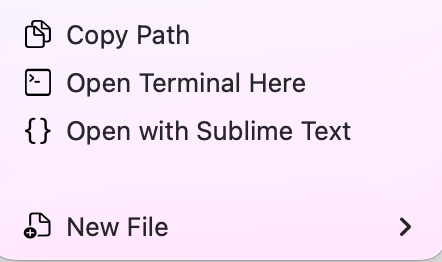
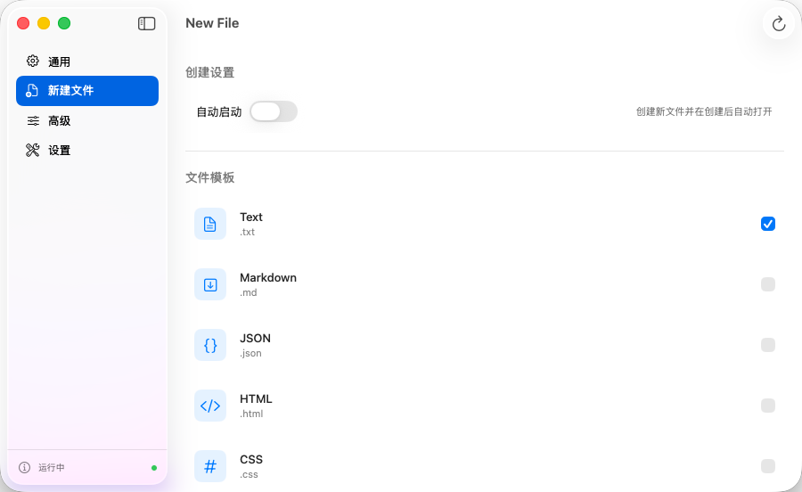
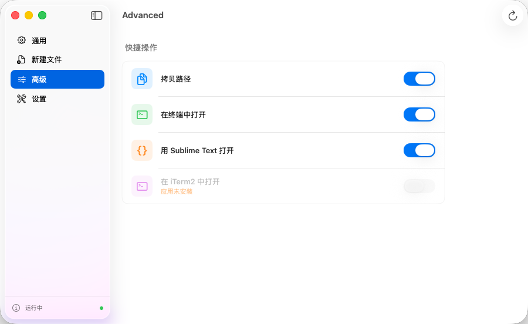
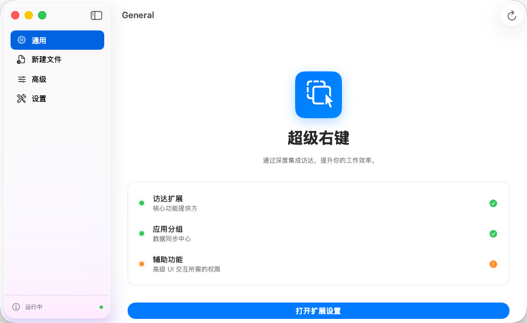

<p align="center">
  
</p>

<h1 align="center">QuickAction</h1>

<p align="center">
  <strong>🚀 macOS Finder 超级右键增强工具</strong><br>
  <em>通过深度集成访达，提升你的工作效率。</em>
</p>

<p align="center">
  
  
  
  
</p>

---

## ✨ 功能特性

### 🖱️ Finder 右键快捷操作
在 Finder 右键菜单中添加常用开发操作，无需打开终端或切换窗口：

- **📋 拷贝路径** — 一键复制文件/文件夹的完整路径
- **💻 在终端中打开** — 直接在 Terminal 打开所在目录
- **📝 用 Sublime Text 打开** — 快速启动编辑器
- **🔲 在 iTerm2 中打开** — 支持 iTerm2 终端（自动检测安装状态）

<p align="center">
  
</p>

### 📄 Finder 新建文件
像 Windows 一样，在 Finder 中右键快速创建各种类型的文件：

- Text (.txt)、Markdown (.md)、JSON (.json)
- HTML (.html)、CSS (.css)、JavaScript (.js)
- Python (.py)、Swift (.swift)、Java (.java) 等
- 支持自定义启用/禁用模板类型

<p align="center">
  
</p>

### ⚡ 状态栏常驻
- 状态栏 ⚡ 图标，点击即可打开主界面或退出
- 不占用 Dock 栏位，安静运行在后台
- 支持开机自动启动

### 🛠️ 高级配置
在主界面中灵活管理所有快捷操作的开关：

<p align="center">
  
</p>

### ⚙️ 设置
- 文件系统访问权限管理（Security-Scoped Bookmarks）
- 开机自动启动开关
- 多语言支持（中文 / English）

<p align="center">
  
</p>

---

## 🏗️ 技术架构

```
QuickAction/
├── QuickAction/                  # 主应用 (SwiftUI)
│   ├── QuickActionApp.swift      # 入口 + 状态栏菜单
│   ├── Managers/
│   │   ├── TemplateManager.swift       # 配置管理 & App Group 同步
│   │   └── LaunchAtLoginManager.swift  # 开机启动管理
│   ├── Models/
│   │   ├── FileTemplate.swift          # 文件模板数据模型
│   │   └── QuickActionItem.swift       # 快捷操作数据模型
│   └── UI/Views/
│       ├── ContentView.swift           # 主导航
│       ├── GeneralView.swift           # 通用概览
│       ├── NewFileView.swift           # 新建文件配置
│       ├── AdvancedView.swift          # 快捷操作管理
│       └── SettingsView.swift          # 权限 & 语言设置
│
├── FinderSyncExt/                # Finder 扩展
│   └── FinderSync.swift          # 右键菜单生成 & 操作分发
│
└── project.yml                   # XcodeGen 工程配置
```

### 核心设计

| 机制 | 说明 |
|---|---|
| **App Group** | 主应用与 Finder 扩展通过 `group.cn.xxstudy.QuickAction` 共享 UserDefaults，实时同步配置 |
| **数据驱动菜单** | 右键菜单由 `QuickActionItem` 模型动态生成，无硬编码 |
| **安装检测** | 通过 `NSWorkspace.urlForApplication(withBundleIdentifier:)` 自动检测第三方应用是否已安装 |
| **Security-Scoped Bookmarks** | 持久化文件系统访问权限，跨进程共享 |
| **Activation Policy** | 使用 `.accessory` 模式实现纯状态栏应用，无 Dock 图标 |

---

## 🚀 快速开始

### 环境要求
- macOS 13.0+
- Xcode 15.0+
- [XcodeGen](https://github.com/yonaskolb/XcodeGen)

### 构建步骤

```bash
# 1. 克隆仓库
git clone https://github.com/yourname/QuickAction.git
cd QuickAction

# 2. 生成 Xcode 工程
xcodegen generate

# 3. 打开工程
open QuickAction.xcodeproj

# 4. 选择 QuickAction scheme，Build & Run
```

### 启用 Finder 扩展

首次运行后，需要手动启用 Finder 扩展：

1. 打开 **系统设置** → **隐私与安全性** → **扩展** → **已添加的扩展**
2. 找到 **QuickAction** → 勾选 **访达扩展**
3. 在主界面点击 **「打开扩展设置」** 可直接跳转

---

## 📝 添加新的快捷操作

项目采用**数据驱动**的扩展方式，添加新操作只需两步：

### 1. 注册操作

在 `TemplateManager.swift` 的 `defaultQuickActions` 中添加一项：

```swift
QuickActionItem(
    id: "open_myapp",
    nameKey: "action.open_myapp",       // 本地化 key
    iconName: "star.fill",              // SF Symbol
    isEnabled: false,
    appBundleIDs: ["com.example.myapp"] // 用于安装检测，nil 表示始终可用
)
```

### 2. 处理操作

在 `FinderSync.swift` 的 `menu(for:)` 中为新 ID 指定 selector 或添加到 `genericAppDispatcher`。

---

## 🌐 本地化

支持中文（简体）和英文，翻译文件位于 `QuickAction/Localizable.xcstrings`。

---

## 📄 License

MIT License © 2026

